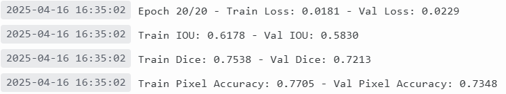

# deeplabv3plus
This is my submision for the VJT Assignment where I have generated the training mask from json annotations and trained DeepLabv3Plus from scratch in PyTorch for CityScapes Dataset.

[WandB Project Dashboard Link](https://wandb.ai/shishirroy-indian-institute-of-science/vjt_assignment/workspace?nw=nwusershishirroy) - [WandB Report Link](https://api.wandb.ai/links/shishirroy-indian-institute-of-science/19x778h8) - [Trained Model 20 epochs](https://api.wandb.ai/files/shishirroy-indian-institute-of-science/vjt_assignment/dj2gtusu/deeplabv3plus_epoch_20.pth)

Model's performance on Val set of CityScapes :

Comment : I have uploaded the model's predictions on test set to the evaluation server of CityScapes, and will upload the results here once I get the public share link.

### Steps to reproduce the above results :
1. Download "gtFine_trainvaltest.zip" and "leftImg8bit_trainvaltest.zip" from the [official website](https://www.cityscapes-dataset.com/downloads/) and extract them in "./data"
2. Run generate_gt.py, it will generate masks (trainId mask, labelId mask, color mask) as per the conventions of CityScapes Dataset and save them in appropriate directory.
3. Open train.py and make some changes depending on what hardware you are running the code on, such as -
  1. Add your own WandB key for login, I have removed mine for obvious reasons.
  2. If you don't have access to multi GPU system, set "multi_gpu" False in the config dict.
  3. You need to set appropriate "batch_size" in the config dict depending on your hardware setup.
4. Run train.py, it will train the model on train set and evaluate the model on val set after each epoch. We are computing and logging the metrics like -
  1. IoU - train_iou_per_class, val_iou_per_class, mean_train_iou, mean_val_iou
  2. Dice Coefficient - train_dice_per_class, val_dice_per_class, mean_train_dice, mean_val_dice
  3. Pixel-wise Accuracy - train_px_acc_per_class, val_px_acc_per_class, mean_train_px_acc, mean_val_px_acc
  4. While computing mean of metrics we ignore the class with trainId 19, as per convention of CityScapes Dataset.
5. During training, after each epoch, train.py will predict the segmentation mask on the first mini-batch of val set and log (image, pred_color_mask, gt_color_mask) to WandB, you can view this in the table named "results_table" where the captions are in the form {file_type}\_{epoch}\_{index}.
7. After training, train.py will save the model weights locally and also on WanbD.
