# deeplabv3plus
This is my submision for the VJT Assignment where I have generated the training mask from json annotations and trained DeepLabv3Plus from scratch in PyTorch for CityScapes Dataset

[WandB Project Dashboard Link](https://wandb.ai/shishirroy-indian-institute-of-science/vjt_assignment/workspace?nw=nwusershishirroy) - [WandB Report Link](https://api.wandb.ai/links/shishirroy-indian-institute-of-science/19x778h8) - [Trained Model 20 epochs](https://api.wandb.ai/files/shishirroy-indian-institute-of-science/vjt_assignment/dj2gtusu/deeplabv3plus_epoch_20.pth)

## Steps to Generate Masks from Annotations :
1. Download "gtFine_trainvaltest.zip" and "leftImg8bit_trainvaltest.zip" from the [official website](https://www.cityscapes-dataset.com/downloads/) and extract them in "./data"
2. Run generate_gt.py, it will generate masks (trainId mask, labelId mask, color mask) as per the conventions of CityScapes Dataset and save them in appropriate directory
3. Following table shows 3 examples of Image, Ground Truth Color Mask, Generated Color Mask. To view all the generated masks, visit [Google Drive Folder](https://drive.google.com/drive/folders/1AEqqiQrBG7_SNS8Ljj-NR0oizyHV5fAO?usp=drive_link)

<table>
  <tr>
    <th>Image</th>
    <th>Ground Truth Color Mask</th>
    <th>Generated Color Mask</th>
  </tr>
  <tr>
    <td>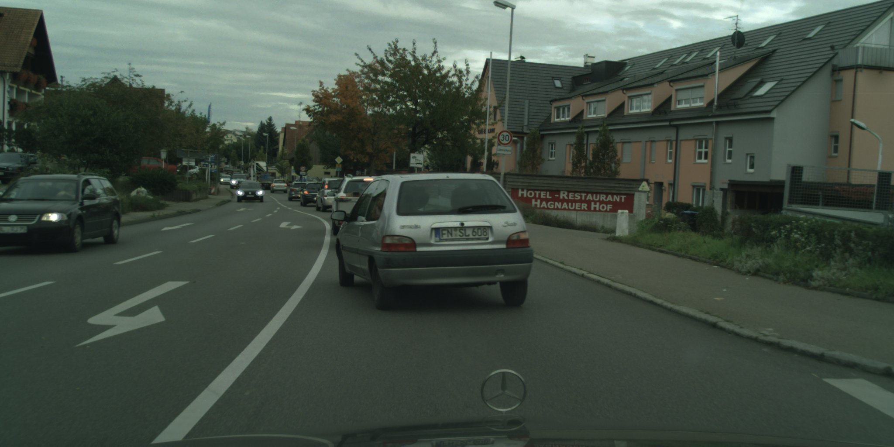</td>
    <td>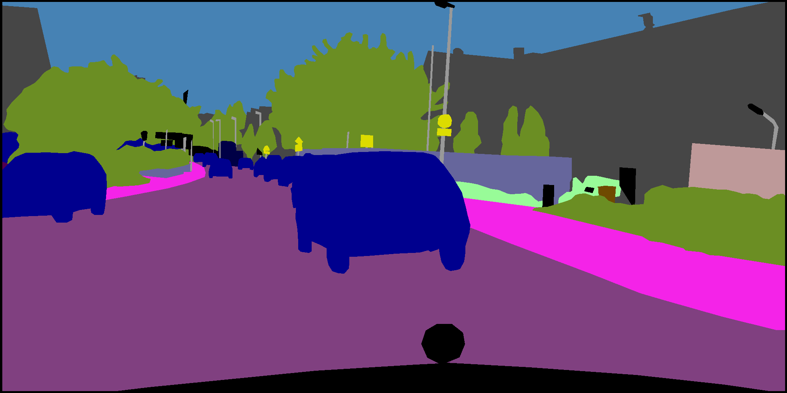</td>
    <td></td>
  </tr>
  <tr>
    <td>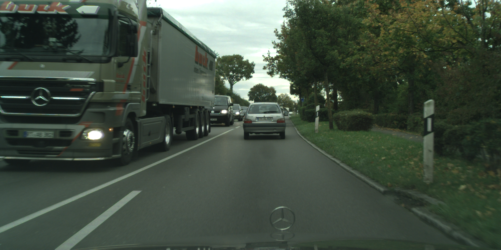</td>
    <td></td>
    <td>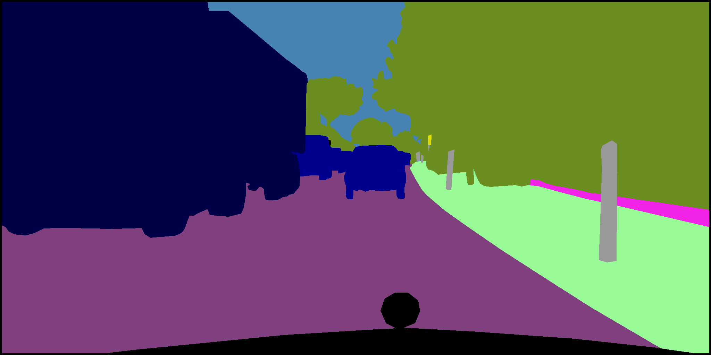</td>
  </tr>
  <tr>
    <td>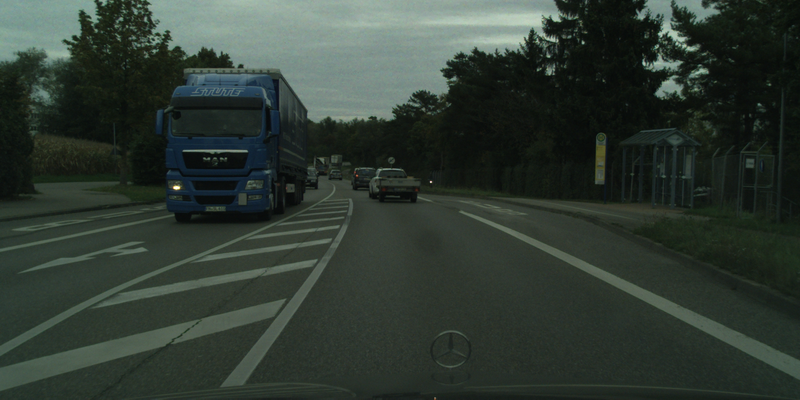</td>
    <td>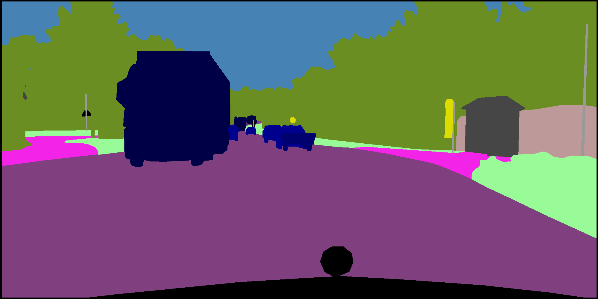</td>
    <td></td>
  </tr>
</table>

## Steps to Train the Model :
1. Open train.py and make some changes depending on your hardware, like updating WandB key, setting "multi_gpu" in the config dict to True (for multi gpu training) or False (for single gpu training) and setting appropriate "batch_size" in the config dict depending on your gpu specifications.
2. Run train.py, it will train the model on train set, evaluate the model on val set after each epoch and log metrics in WandB.

## Performance Metrics during Training :

<table>
  <tr>
    <td>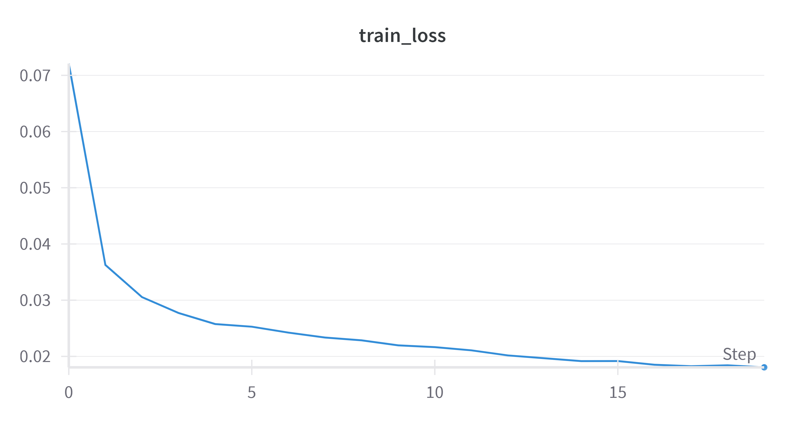 Training Loss</td>
    <td>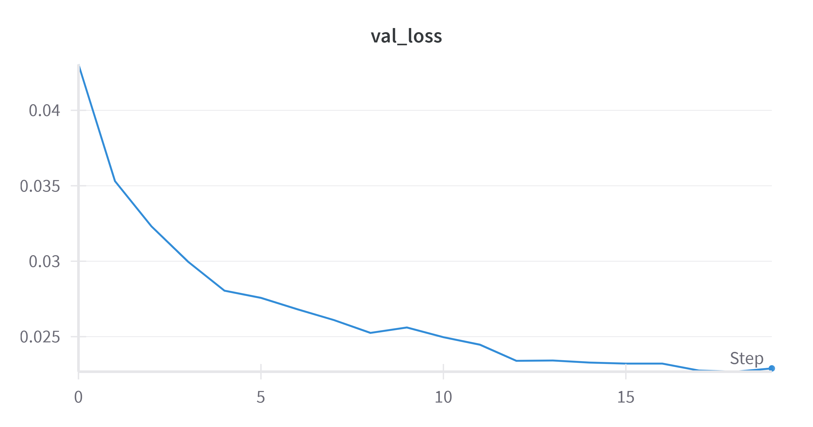 Validation Loss</td>
  </tr>
  <tr>
    <td>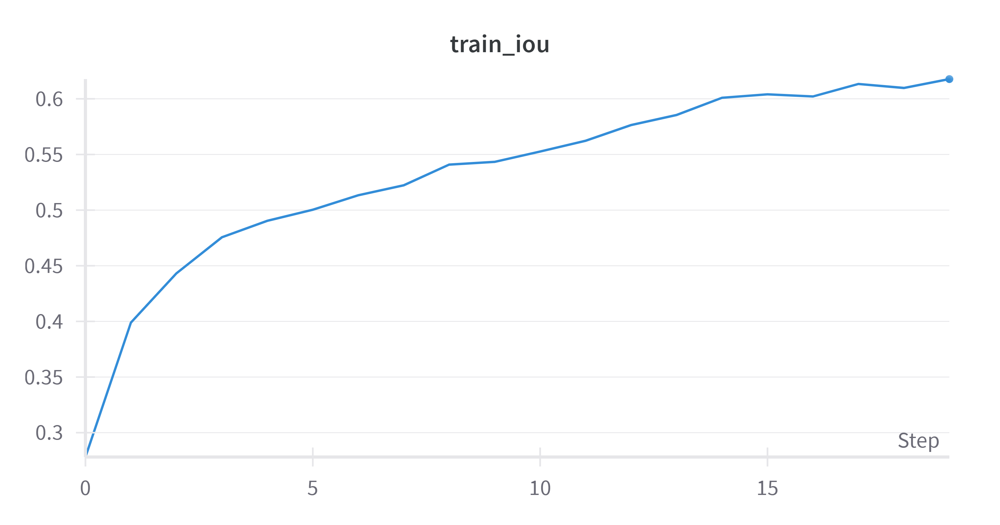 Mean Train IoU</td>
    <td>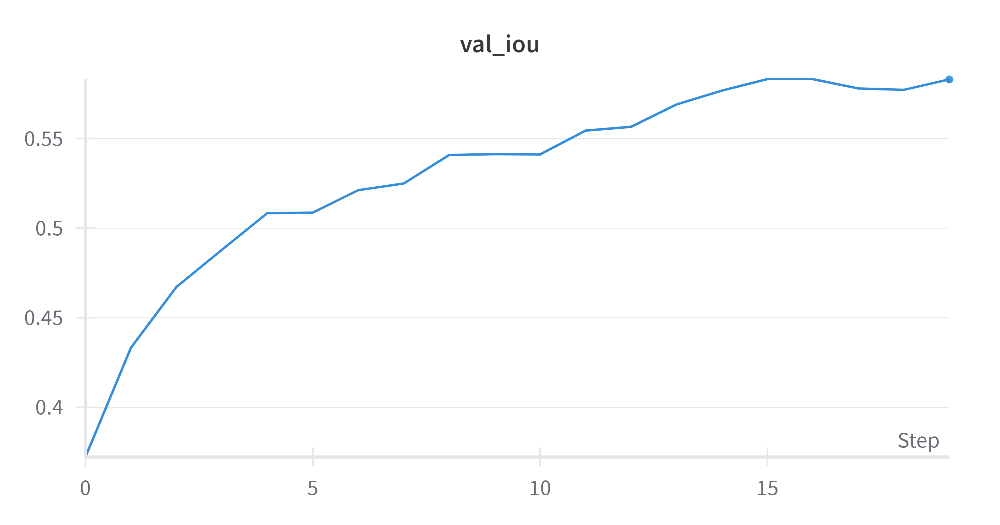 Mean Validation IoU</td>
  </tr>
  <tr>
    <td>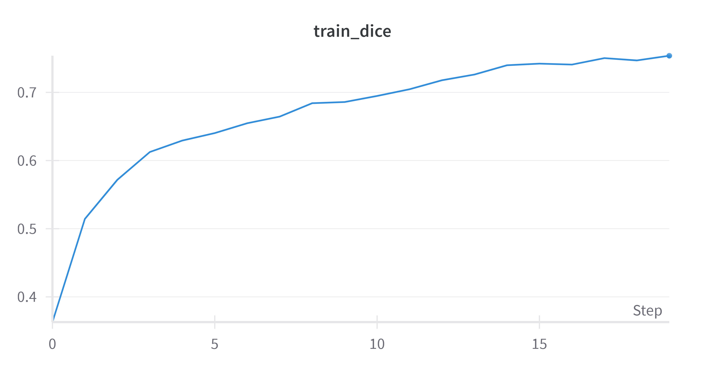 Mean Train Dice Coefficient</td>
    <td>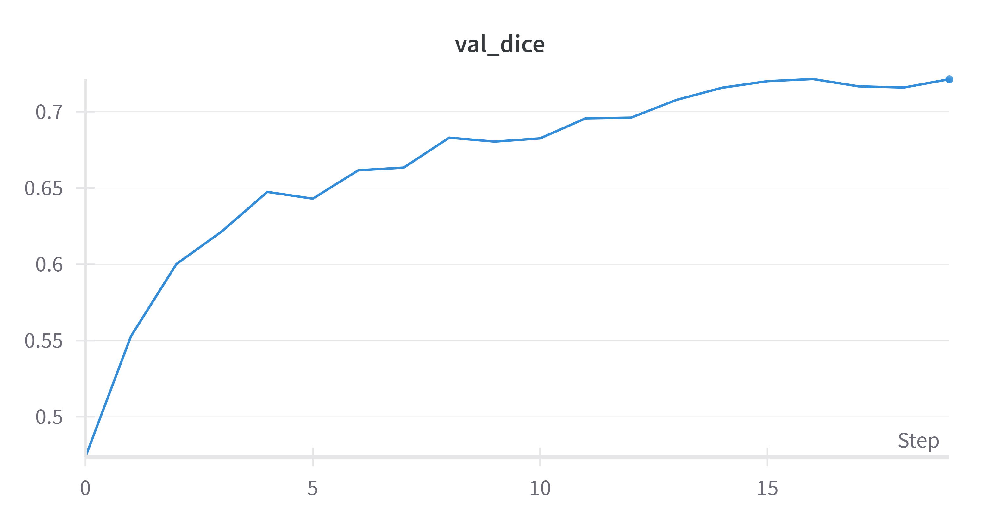 Mean Validation Dice Coefficient</td>
  </tr>
  <tr>
    <td>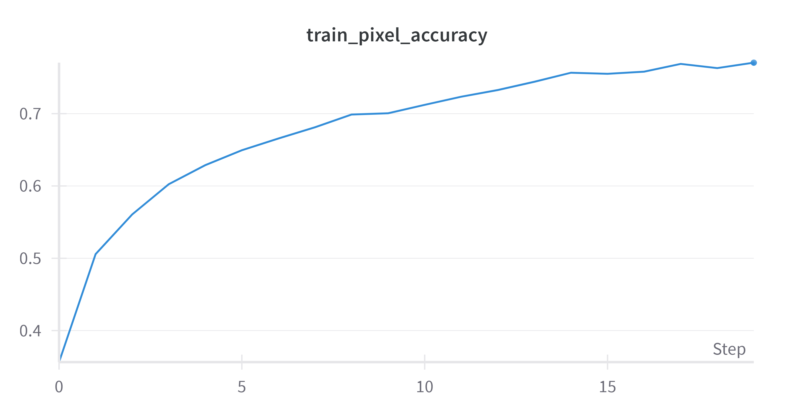 Mean Train Pixel Accuracy</td>
    <td>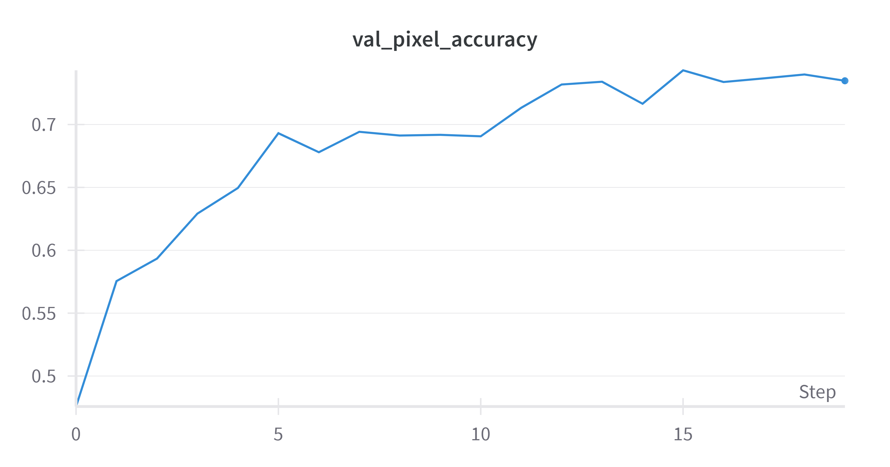 Mean Validation Pixel Accuracy</td>
  </tr>
</table>

<table>
  <tr>
    <td>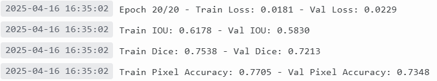 Model Performance on CityScapes Train-Validation Set</td>
    <td> Model Evaluation on CityScapes Test Set</td>
  </tr>
</table>

Comment : Model's performance metrics on test set computed by the official evaluation server of CityScapes can be viewed from [here](https://www.cityscapes-dataset.com/anonymous-results/?id=0645d64f200dc388058d41efad92e8a9ac9fb3d4bf7c5db8b506d3b502db2de8)

## Steps to Train the Model :
4.  We are computing and logging the metrics like -
  1. IoU - train_iou_per_class, val_iou_per_class, mean_train_iou, mean_val_iou
  2. Dice Coefficient - train_dice_per_class, val_dice_per_class, mean_train_dice, mean_val_dice
  3. Pixel-wise Accuracy - train_px_acc_per_class, val_px_acc_per_class, mean_train_px_acc, mean_val_px_acc
  4. While computing mean of metrics we ignore the class with trainId 19, as per convention of CityScapes Dataset.
5. During training, after each epoch, train.py will predict the segmentation mask on the first mini-batch of val set and log (image, pred_color_mask, gt_color_mask) to WandB, you can view this in the table named "results_table" where the captions are in the form {file_type}\_{epoch}\_{index}.
7. After training, train.py will save the model weights locally and also on WanbD.
