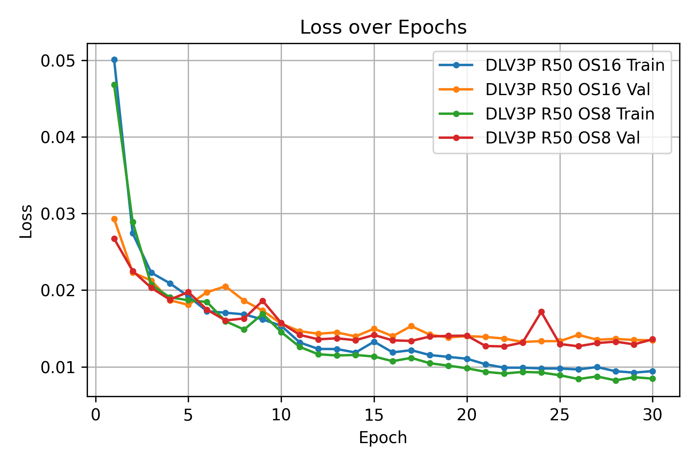
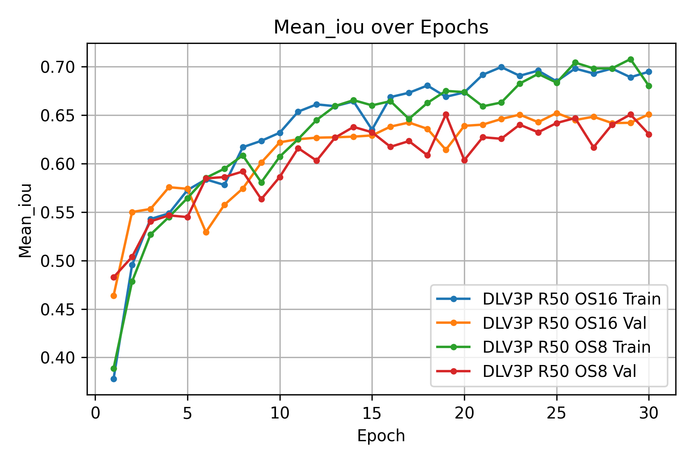
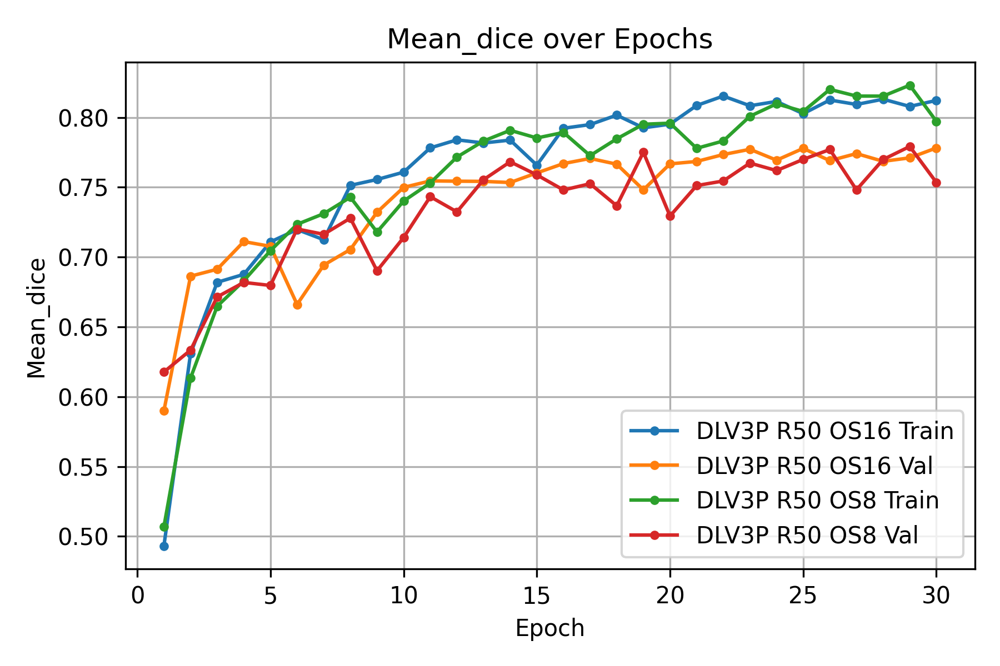
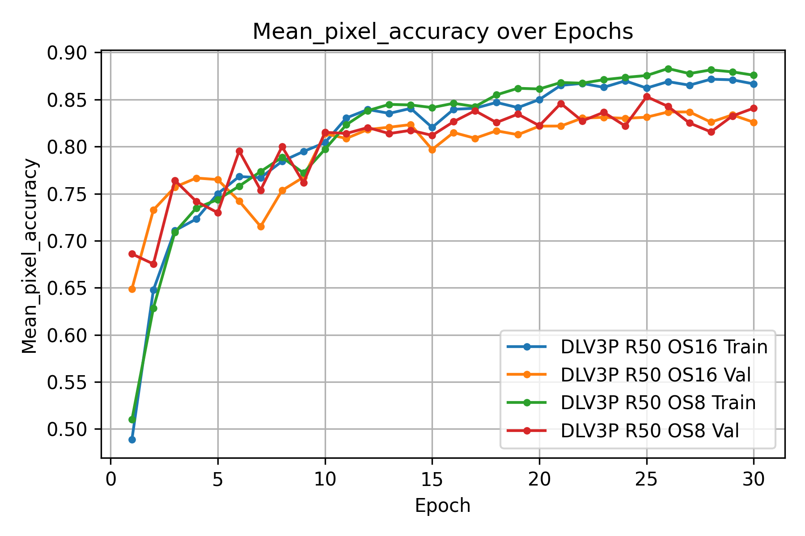
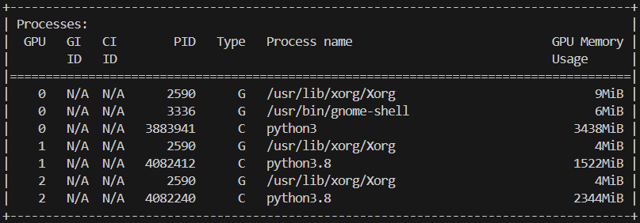

# DeepLabV3Plus
PyTroch Implementation of DeepLabV3Plus.

Download trained model weights from [here](https://drive.google.com/drive/folders/1ZR9svn9aiiVfMIOQ8kJ_ohvcQplOk4qK?usp=sharing).

## Generating Masks from Annotations :
- Download "gtFine_trainvaltest.zip" and "leftImg8bit_trainvaltest.zip" from the [official cityscapes website](https://www.cityscapes-dataset.com/downloads/) and extract them in "./data".
- Run [generate_gt.py](./cityscapes/generate_gt.py), it will generate masks (trainId mask, labelId mask, color mask) as per the conventions of CityScapes Dataset and save them in appropriate directory.
- Comparing the generated mask with provided masks:


## Dataset
Make sure the project folder looks like this:
```
Project/
├── cityscapes/
│   └── ... (python scripts for data loader and utils)
├── data/
│   ├── generated_gt
│   ├── leftImg8bit
│   ├── gtFine
│   └── ... (other files from dataset)
├── deeplabv3plus/
│   └── ... (python scripts for DeepLabV3Plus model and utils)
├── outputs/
│   └── ... (output directory)
├── saved/
│   └── ... (save directory during training)
├── save_predictions.ipynb
├── test_dlv3p.py
├── train_dlv3p.py
├── visualize_training.ipynb
└── ... (other files from project)
```


## Training
- Run the following command to train DeepLabV3Plus model:
```
python train_dlv3p.py --backbone "{resnet50/resnet101/resnet152}" --output_stride "{8/16}"
```

- Training Metrics:
<table style="width: 100%;">
  <tr>
    <td></td>
    <td></td>
  </tr>
  <tr>
    <td></td>
    <td></td>
  </tr>
  <tr>
    <td></td>
    <td></td>
  </tr>
  <tr>
    <td></td>
    <td></td>
  </tr>
</table>

Comment: The above plots are generated using [visualize_training.ipynb](visualize_training.ipynb)


## Performance
- Run the following command to evaluate DeepLabV3Plus model on test set:
```
python test_dlv3p.py  --backbone "{resnet50/resnet101/resnet152}" --output_stride "{8/16}" --model_weights_path "./saved/{file_name}.pth"
```
- DeepLabV3Plus Resnet-50 Output Stride 8 Model evaluation on test set from official evaluation server:

<table style="width: 100%;">
  <tr>
    <td></td>
    <td rowspan="2"></td>
  </tr>
  <tr>
    <td></td>
  </tr>
</table>

Comment: The code saves all the predictions in the directory [outputs/{model_name}](./outputs/) which can be zipped and uploaded to the official evaluation server to get the model performance evaluated.


## Predictions 
- DeepLabV3Plus Resnet-50 Output Stride 8 Model Predictions: 


- DeepLabV3Plus Resnet-50 Output Stride 16 Model Predictions:


## Model Details
- Memory Requirements of Models:

- Average Inference time of DeepLabV3Plus Resnet-50 Output Stride 8 Model:

- Average Inference time of DeepLabV3Plus Resnet-50 Output Stride 16 Model:


Comment:
- DeepLabV3Plus Resnet-50 Output Stride 8 Model (pid=4082240) requires 2.3 GB VRAM for inference on complete image of size 1024 x 2048.
- DeepLabV3Plus Resnet-50 Output Stride 16 Model (pid=4082412) requires 1.5 GB VRAM for inference on complete image of size 1024 x 2048.
- DeepLabV3Plus Resnet-50 Output Stride 8 Model takes about 0.20 seconds for inference on complete image of size 1024 x 2048.
- DeepLabV3Plus Resnet-50 Output Stride 16 Model takes about 0.13 seconds for inference on complete image of size 1024 x 2048.